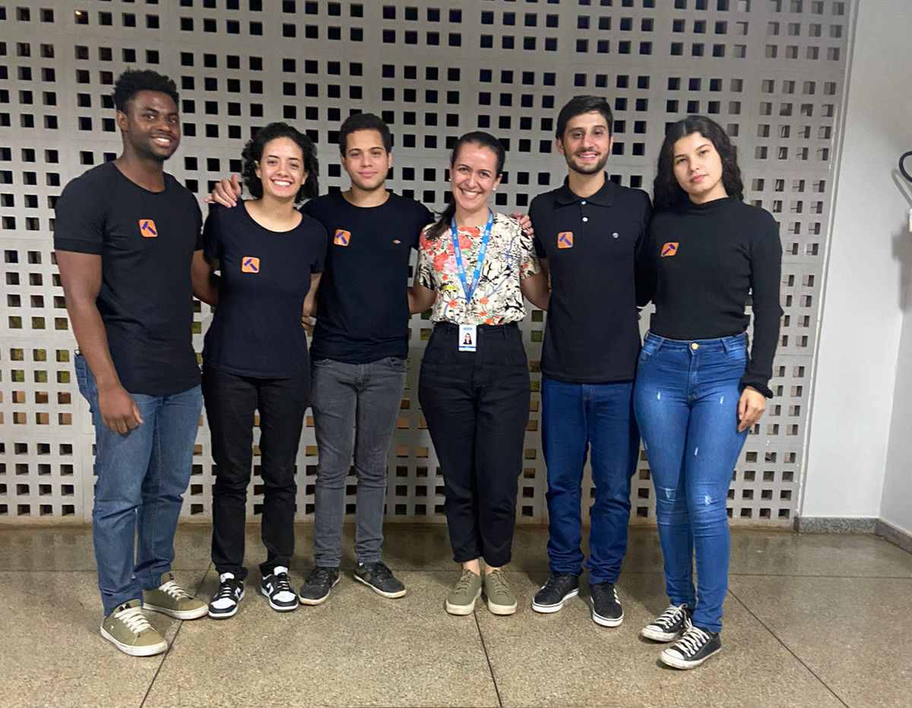

 
 

Conecta você a um profissional da área de construção civil, e ainda te mantém informado sobre novidades do setor.

 
 

&nbsp;&nbsp;&nbsp;&nbsp;

 
 
 
 

# Projeto

O app foi desenvolvido para um projeto de inovação do Curso **Técnico em Edificações**, pela instituição [SENAI CFP Dr. Celso Charui - Pará de Minas](https://www7.fiemg.com.br/senai/mais-senai/na-sua-cidade/senai-para-de-minas-cfp-dr-celso-charuri). O app mobile foi desenvolvido usando React-native e Expo, com a linguagem Typescript. O server foi desenvolvido usando a funcionalidade _route apis_ do Next.js, com Typescript.

# Grupo

O grupo foi composto por [Mim](https://github.com/mateusfg7) (desenvolvedor), [Marcos Túlio](https://www.instagram.com/tuliotudobom/), [Gabriel Ferrari](https://www.instagram.com/gabriel_fst/), [Lívya Monique](https://www.instagram.com/livyamonique_/) e Maria Fernanda, sob a supervisão da professora [Melina Duarte](https://www.instagram.com/melinalduarte/).

# Assets

- [Documento](assets/Formatch.pdf) com a parte escripta com o projeto
- [Documento](assets/Formatch_Presentation.pdf) ou [arquivo de slide](Formatch_Presentation.pptx) usado na apresentação do projeto
- [Documento](assets/Formatch_Custos.pdf) ou [arquivo de planilhas](Formatch_Custos.xlsx) da escrutura de custos e receitas do projeto
- [Formulário](assets/Formatch_form.pdf) e [resultados](Formatch_form_results.xlsx) da pesquisa de mercado